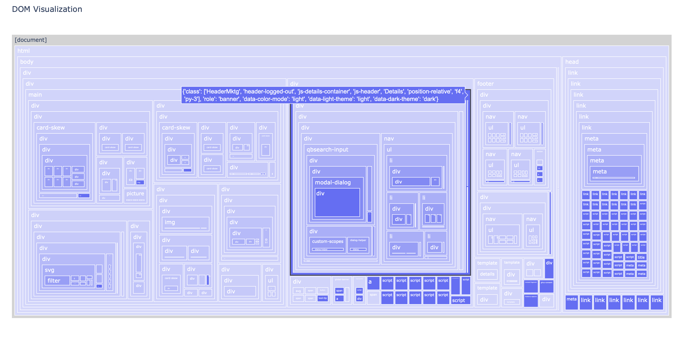
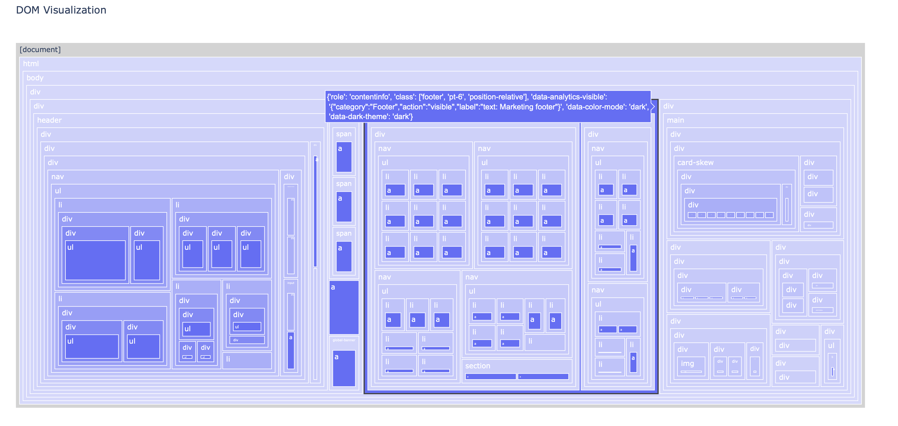

# html-dom-visualize
A simple HTML to Tree Diagram library that outputs HTML DOM as image for visualization. Supports custom DOM elements filtering and masking. Uses [plotly](https://github.com/plotly/plotly.py) underlying for graph generation.

Useful when analyzing elements composition of HTML documents or developing tools that manipulates HTML DOM structures.

## Install
```
pip install html-dom-visualize
```

## Using as python library

#### Basic Usage
```python
from html_dom_visualize import html_dom_visualize

# Directly load html
html_dom_visualize(html="<html>...</html>", show=True)
# Load URL
html_dom_visualize(url="https://github.com", show=True)
# Load html file
html_dom_visualize(file_path="./github.html", show=True)
```

#### Using branch filtering & element masking
```python
html = """
<html>
    <body>
        <h1>
            <span>My First Heading</span>
        </h1>
        <div>
            <p>My first paragraph.</p>
            <button>
                <div>click me</div>
                <span>some texts</span>
            </button>
            <div>
                <div>
                    <span>some other texts</span>
                </div>
            </div>
        </div>
    </body>
</html>
"""

# This masks all 'button' tags (remove their descendents), and only show the inner texts in the visualization.
html_dom_visualize(
    html=html,
    should_mask=lambda el: el.name == 'button', 
    mask_fn=lambda el: el.get_text(),
    show=True
)

# This filter out all branches that does NOT contains a <h1> tag
html_dom_visualize(
    html=html,
    should_mask=lambda el: el.name == 'button', 
    mask_fn=lambda el: el.get_text(),
    show=True
)
```

## Using in Command line
```sh
options:
  -h, --help            show this help message and exit
  -u URL, --url URL     URL of the HTML page to analyze
  -f FILE, --file FILE  Path to local HTML file to analyze
  -b BRANCH, --branch BRANCH
                        Element tags that if included, their
                        ancestors and all their descendants
                        would be preserved. Multiple tags can
                        be specified If not specified, all
                        elements will be preserved.
  -m MASK, --mask MASK  Element tags that if included, they
                        will be masked from the output graph
                        such that their children will be
                        removed, and only the inner texts will
                        be preserved. Multiple tags can be
                        specified. If not specified, no tags
                        will be masked.
  -o OUTPUT, --output OUTPUT
                        Output file path for the visualization.
                        If not provided, the visualization will
                        be displayed in the browser.
  --show                Display the visualization in the
                        browser. If provided, the visualization
                        will be displayed.

example:
# only include branches that contains <button> / <input>
# mask out children inside <button> and <a>
html-dom-visualize -f ./webpage.html -b button -b input -m a -m button

# load from URL, show after rendered, and save to ./google.png
html-dom-visualize -u https://google.com --show -o ./google.png
```

## Output
It outputs a TreeMap type of graph, generated by [plotly](https://github.com/plotly/plotly.py). If using interactive mode, the diagram can be interactive such that it display details upon mouse hover, and able to zoom in/out if the DOM level beyonds default limit.

##### Sample full DOM of a google.com


##### Sample masked DOM of github.com
